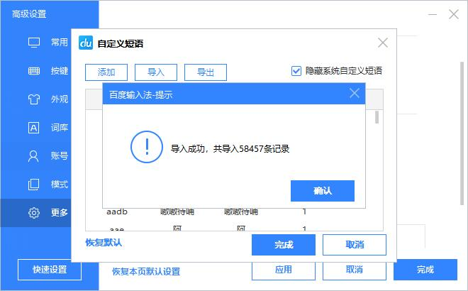

# 小鹤音形辅助码配置文件格式转换
将小鹤音形官网提供的『 for安卓百度个性短语.ini 』文件转换为**Windows版百度输入法**支持的配置文件

小鹤音形官网下载的挂接辅助码格式为 **[字码]=[候选位置],[候选词]**  例: **bag=1,靶**

Windows版百度输入法支持的配置文件格式为 **[候选位置],[字码]=[候选词]** 例: **1,bag=靶**

将从小鹤音形官网下载的辅助码文件 **for安卓百度个性短语.ini** 放入同目录下执行Python脚本即可完成转换

也可直接下载转换好的 **for安卓百度个性短语-PC.txt** 导入Windows版的百度输入法

***以上使用的是小鹤音形官网2022/3/20更新的辅助码，若之后更新了辅助码可自行下载进行转换**

